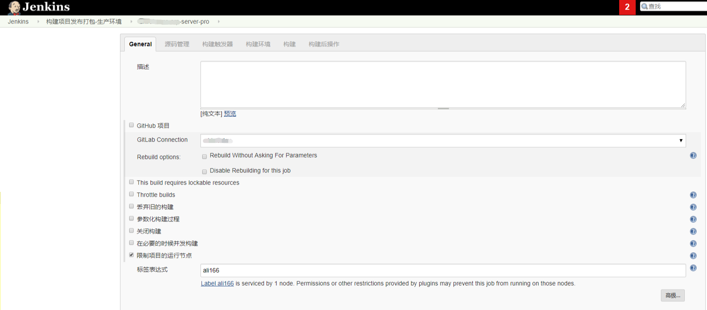
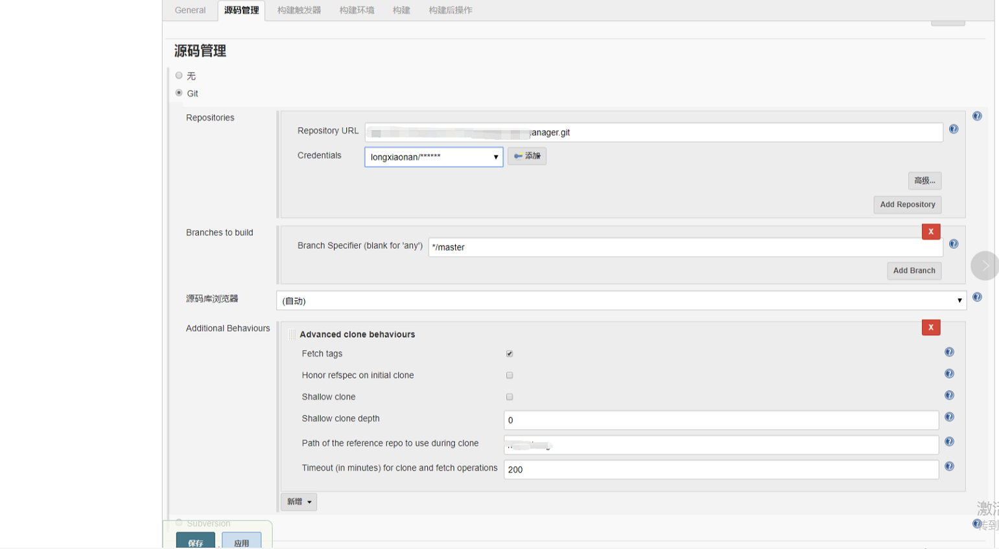
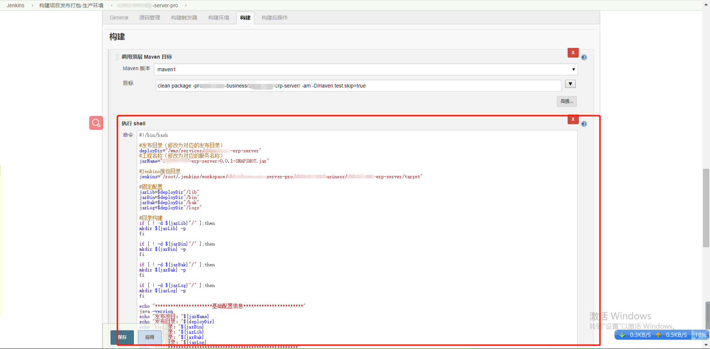

### general

### 源码管理

### 构建

通过shell脚本进行构建

shell脚本如下：
```shell
#!/bin/bash

#发布目录（修改为对应的发布目录）
deployDir="/wms/services/xxx-xx-erp-server"
#工程名称（修改为对应的服务名称）
jarName="xxx-xx-erp-server-0.0.1-SNAPSHOT.jar"

#Jenkins推包目录
jenkins="/root/.jenkins/workspace/xxx-xx-erp-server-pro/xxx-xx-business/xxx-xx-erp-server/target"

#固定配置
jarLib=$deployDir"/lib"
jarBin=$deployDir"/bin"
jarBak=$deployDir"/bak"
jarLog=$deployDir"/logs"

#目录构建
if [ ! -d ${jarLib}"/" ];then
mkdir ${jarLib} -p
fi

if [ ! -d ${jarBin}"/" ];then
mkdir ${jarBin} -p
fi
	
if [ ! -d ${jarBak}"/" ];then
mkdir ${jarBak} -p
fi
	
if [ ! -d ${jarLog}"/" ];then
mkdir ${jarLog} -p
fi

echo "**********************基础配置信息***********************"
java -version
echo "发布项目："${jarName}
echo "发布目录："${deployDir}
echo "bin目录："${jarBin}
echo "lib目录："${jarLib}
echo "bak目录："${jarBak}
echo "日志目录："${jarLog}
echo "*******************************************************"

#检查新报是否已经推送到本地，如果存在则进行后续操作
if [ "$(ls ${jenkins}/${jarName} 2> /dev/null | wc -l)" != "0" ]; then
	#备份文件
	oldJarName="`ls ${jarLib} | grep .jar | sort -nr | head -1`"
	echo "开始备份Jar包："${jarLib}"/"${oldJarName}
	bakJarName=${oldJarName}$(date +%s)
	echo "备份"${jarLib}"/"${oldJarName}"到"${jarBak}"/"${bakJarName}
	cd ${deployDir}
	if [ "$(ls "lib/"*.jar 2> /dev/null | wc -l)" != "0" ]; then
		mv ${jarLib}"/"${oldJarName} ${jarBak}"/"${bakJarName}
		echo "备份Jar包成功"
	else
		echo "无Jar可以备份"
	fi
	echo "复制新的包到指定的目录"
	cd ${jenkins}
	echo "迁移新包到目录："${jarLib}
	cp ${jenkins}"/"${jarName} ${jarLib}
	echo "重启服务："${jarBin}
	cd ${jarBin}
	sh restart.sh
else
	echo "找不到发布包：${jenkins}/${jarName}"
	exit 1
fi
```